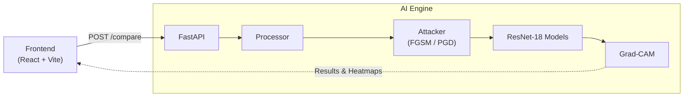
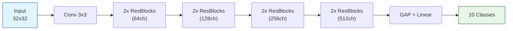

<div align="center">

# 🔍 Adversarial Lens

**Visualize and evaluate the effects of adversarial attacks on deep learning image classifiers.**

[](https://www.python.org/)
[](https://fastapi.tiangolo.com/)
[](https://react.dev/)
[](https://pytorch.org/)

[Overview](#-overview) • [Features](#-features) • [Models](#-models) • [Architecture](#-architecture) • [Setup](#-local-setup) • [Usage](#-usage)

</div>

---

## 📖 Overview

**Adversarial Lens** is a full-stack application that lets you interactively explore how adversarial attacks fool deep learning models — and how adversarially trained models resist them. Upload an image, choose your attack, and compare a standard vs. robust ResNet-18 side-by-side with Grad-CAM heatmap overlays.

---

## ✨ Features

| Feature | Description |
|---|---|
| 🖼️ **Interactive Attacks** | Upload custom images or fetch random CIFAR-10 samples as targets |
| ⚙️ **Configurable Adversaries** | Tune attack type (FGSM / PGD) and perturbation intensity (ε) |
| ⚖️ **Side-by-Side Benchmarking** | Compare Standard vs. Robust model predictions on clean and perturbed images |
| 🧠 **Grad-CAM Explainability** | Heatmap overlays showing which image regions each model focuses on |

---

## 🤖 Models

Both models share the same ResNet-18 backbone but differ in how they were trained:

<table>
<tr>
<th>Model</th>
<th>Training Method</th>
<th>Clean Accuracy</th>
<th>Adversarial Robustness</th>
</tr>
<tr>
<td><b>Standard ResNet-18</b></td>
<td>Conventional supervised training on CIFAR-10</td>
<td>~93%</td>
<td>❌ Highly susceptible</td>
</tr>
<tr>
<td><b>Robust ResNet-18</b></td>
<td>Adversarial Training via PGD</td>
<td>Slightly lower</td>
<td>✅ Reliably robust</td>
</tr>
</table>

> The robust model trades a small amount of clean accuracy for reliable predictions under heavy adversarial perturbation.

---

## 🏗️ Architecture

### Application Architecture



### ResNet-18 Model Architecture



---

## 💻 Local Setup

### Prerequisites

- Python 3.8+
- Node.js 18+
- Git

---

### 1. Clone the Repository

```bash
git clone https://github.com/Sohanuu66/Adversarial-lens.git
cd Adversarial-lens
```

---

### 2. Backend Setup

Set up a virtual environment and install Python dependencies from the **project root**:

```bash
# Create and activate virtual environment
python -m venv .venv

# macOS / Linux
source .venv/bin/activate

# Windows
.venv\Scripts\activate

# Install dependencies
pip install -r requirements.txt
```

> [!NOTE]
> **About Datasets:** Raw CIFAR-10 data in `assets/data/` is intentionally excluded from Git to keep the repo lightweight. Pre-trained `.pth` model checkpoints (`outputs/checkpoints/`) and sample UI images are already included so you can run the app right away.
>
> To **re-train models** or run evaluation notebooks, execute Jupyter Notebooks 1–4 sequentially to download datasets and repopulate the required directories.

---

### 3. Start the Backend Server

Run the FastAPI server from the **project root** (not inside `backend/`), since modules are structured relative to the root:

```bash
uvicorn backend.main:app --reload
```

The API will be live at: **`http://127.0.0.1:8000`**

---

### 4. Start the Frontend

In a **new terminal**, navigate to the `frontend/` folder and start the React dev server:

```bash
cd frontend
npm install
npm run dev
```

The UI will be available at: **`http://localhost:5173`**

---

## 🚀 Usage

1. Open `http://localhost:5173` in your browser
2. Upload an image or fetch a random CIFAR-10 sample
3. Select an attack type — **FGSM** or **PGD** — and set the perturbation strength (ε)
4. Click **Compare** to run the attack
5. Inspect side-by-side predictions and Grad-CAM heatmaps for both models

---

## 📁 Project Structure

```
Adversarial-lens/
│
├── backend/
│   ├── main.py            # FastAPI entry point
│   ├── api/               # Route handlers
│   ├── attacks/           # FGSM & PGD implementations
│   ├── models/            # ResNet-18 model definitions
│   └── explainability/    # Grad-CAM logic
│
├── frontend/
│   ├── src/               # React components & pages
│   └── vite.config.js
│
├── outputs/
│   └── checkpoints/       # Pre-trained .pth model weights
│
├── assets/
│   └── data/              # CIFAR-10 data (git-ignored)
│
├── requirements.txt
└── README.md
```

---

## 📜 License

This project is open-source and available under the [MIT License](LICENSE).
