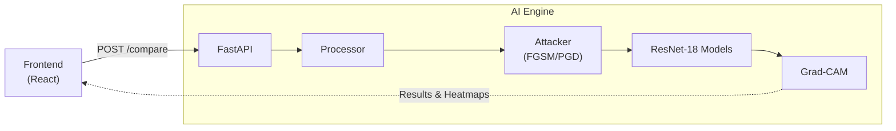
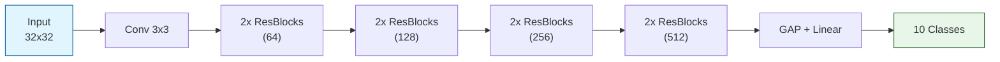

# Adversarial Lens

Adversarial Lens is a full-stack application designed to visualize and evaluate the effects of adversarial attacks on deep learning image classification models.

## Features

- **Interactive Attacks:** Upload custom images or fetch random CIFAR-10 samples to use as targets.
- **Configurable Adversaries:** Configure the type and intensity of adversarial attacks, directly supporting Fast Gradient Sign Method (FGSM) and Projected Gradient Descent (PGD).
- **Side-by-Step Benchmarking:** Compare a Standard Model against an Adversarially Robust Model to observe their behavior against clean and perturbed imagery.
- **Explainable Insights (Grad-CAM):** View Grad-CAM heatmaps that highlight the specific regions of the image the neural networks use to classify objects, helping to demystify how models are fooled and how robust networks hold their ground.

## Models Used

Both models implemented in this project share the same foundation but differ in their training methodologies:
- **Standard Model (ResNet-18):** A Deep Convolutional Neural Network trained conventionally on the CIFAR-10 dataset. It achieves high accuracy (approx. ~93%) on clean images but remains highly susceptible to adversarial perturbations. 
- **Robust Model (ResNet-18):** Identical in structure to the Standard Model, but trained specifically using **Adversarial Training** via Projected Gradient Descent (PGD). It sacrifices a small percentage of clean accuracy to ensure reliable, robust predictions under heavy adversarial attacks.

## Architecture

### Website Architecture


### Model Architecture Diagram (ResNet-18)


## Local Setup

### 1. Repository Setup & Dependencies
First, clone the repository and install the Python dependencies from the root directory. It is highly recommended to use a virtual environment.
```bash
# Clone the repository
git clone <your-repo-url>  # replace with the actual repository URL
cd Adversarial_lens

# Set up a virtual environment (optional but recommended)
python -m venv .venv
source .venv/bin/activate  # On Windows use: .venv\Scripts\activate

# Install core dependencies
pip install -r requirements.txt
```

> [!NOTE] 
> **Missing Datasets:** To keep the repository lightweight, raw datasets (like CIFAR-10) in `assets/data/` are intentionally ignored by Git. The pre-trained `.pth` model checkpoints (in `outputs/checkpoints/`) and sample UI images are already included, so you can run the app immediately. 
> However, if you plan to re-train the models or run the evaluation notebooks yourself, you must execute the Jupyter Notebooks (1 through 4) sequentially to download the datasets and re-populate the directories.

### 2. Running the Backend
Because Python modules are structured relative to the project root (e.g., `from backend.api...`), you must start the server from the **root** project directory, *not* inside the `backend/` folder:
```bash
uvicorn backend.main:app --reload
```
The FastAPI wrapper will start at `http://127.0.0.1:8000`.

### 3. Running the Frontend
The visual interface is built with React and Vite. Open a new terminal, navigate to the `frontend/` folder, install the Node modules, and start the development server:
```bash
cd frontend
npm install
npm run dev
```
The React development server will start and typically be accessible at `http://localhost:5173`.
